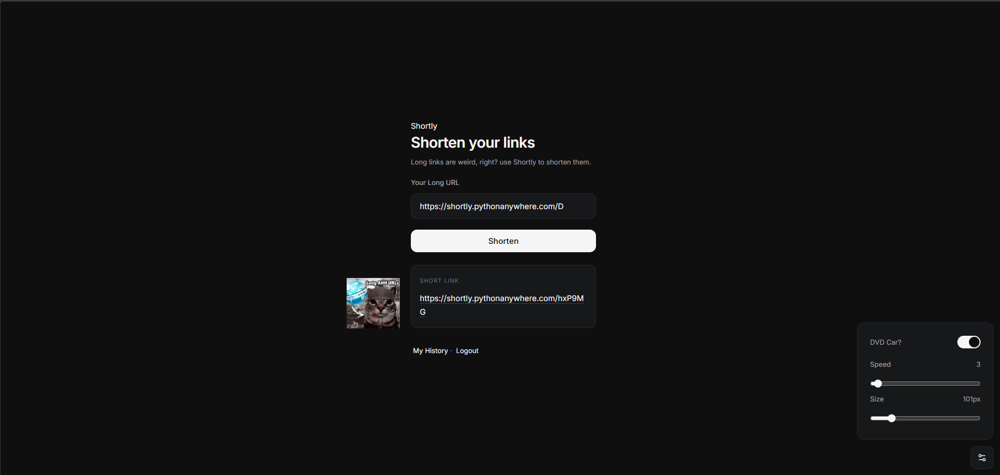
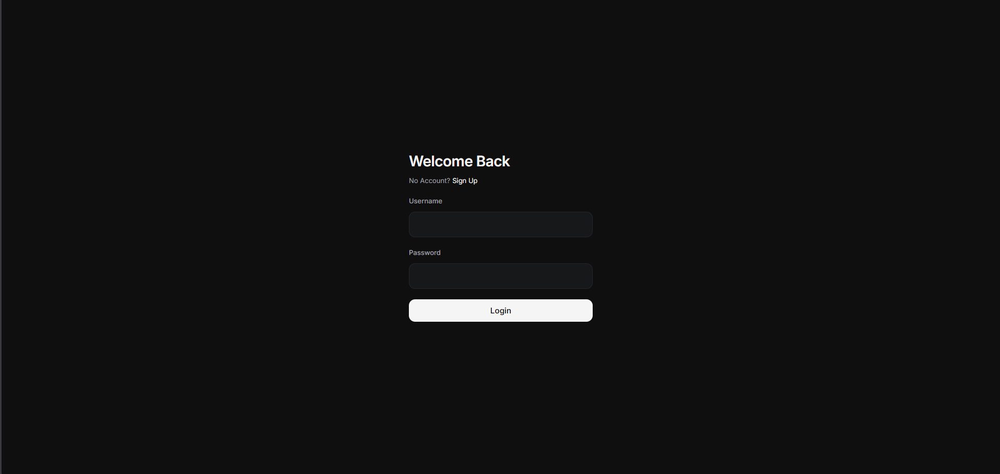
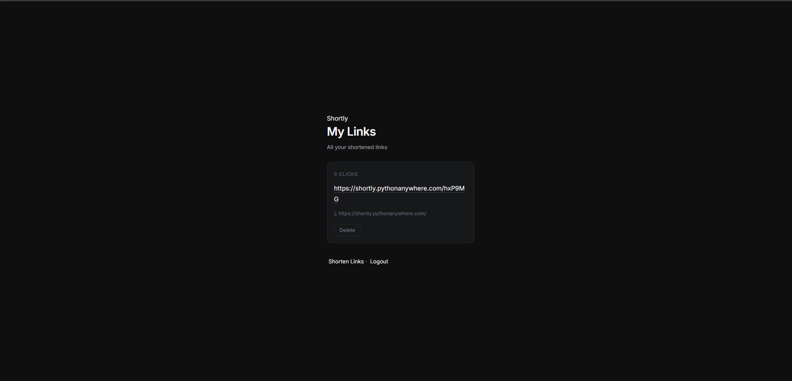

<div align="center">


# Shortly

**A simple url shortener built with flask and sqlite for [Slushies](https://slushies.hackclub.com/) HackClub YSWS**

[](https://github.com/Rexaintreal/shortly)
[](https://flask.palletsprojects.com/)
[](https://hackatime.hackclub.com/)

</div>

## About
Shortly is a URL shortener I built with flask and sqlite with a history page link tracking deleting link and a bouncing dvd cat meme cz whynot :3 

---
## Live Demo

- You can try shortly at [https://shortly.pythonanywhere.com/](https://shortly.pythonanywhere.com/)

## Screenshots






## Features

- **User Authentication** - login and signup with hashed passwords (SECURE)
- **URL Shortening** - it generates a random 6 character short codes for your link
- **Click Tracking** - counts how many ppl have visited your link
- **History Page** - all your links with clicks and delete button
- **DVD Cat** - A bouncing dvd cat you can control with speed and size sliders

---

## Tech Stack

- **Backend** - Python / Flask
- **Database** - SQLite
- **Frontend** - HTML, CSS, Vanilla JavaScript
- **Icons** - Lucide
- **Font** - Inter (Google Fonts) 

---

## Setup

1. **Clone the repo**
```bash
git clone https://github.com/Rexaintreal/shortly.git
cd shortly
```

2. **Install dependencies**
```bash
pip install -r requirements.txt
```

3. **Run the app**
```bash
python app.py
```

4. **Open in browser**
```
http://localhost:5000 or http://127.0.0.1:5000/
```
The shortly.db database is created automatically!

---

## Project Structure
```
shortly/
├── static/
│   ├── css/
│   │   └── styles.css
│   ├── js/
│   │   └── script.js
│   └── images/
│       └── dvdcat.png
├── templates/
│   ├── index.html
│   ├── login.html
│   ├── signup.html
│   └── history.html
├── app.py
├── requirements.txt
├── .gitignore
├── LICENSE
├── README.md
└── shortly.db
```

---

## Author

**Saurabh Tiwari**

- GitHub: [@Rexaintreal](https://github.com/Rexaintreal)
- Portfolio: [Link](https://saurabhcodesawfully.pythonanywhere.com/)

---

## License

MIT License - see [LICENSE](LICENSE) for details.
```